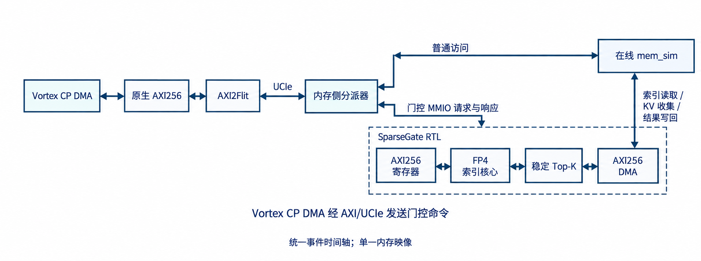

# StorageStacked-SparseGate

本仓库实现 **Vortex 命令处理器 DMA → AXI256 → AXI2Flit → UCIe → 存储侧 SparseGate RTL → 在线 mem_sim**。门控命令由 Vortex CP DMA 发出；gem5 的 SE 宿主进程负责运行 Vortex 软件和配置命令处理器，程序与栈使用独立本地页池。仓库不包含 CPU 发起门控或 CoralNPU 的运行链路。



## 实现与证据

- [`rtl/sparse_gate`](rtl/sparse_gate/)：E2M1 FP4、E8M0 缩放、有符号 BF16 权重、32 头评分和稳定 Top-512 选择。
- [`rtl/sparse_gate_axi`](rtl/sparse_gate_axi/)：AXI256 寄存器、独立 DMA、错误和背压处理。
- [`gem5_axi`](gem5_axi/)：Vortex 请求经 UCIe 到门控 RTL 与在线存储的适配器。
- [`evidence/system/vortex_gate_cp.json`](evidence/system/vortex_gate_cp.json)：已保存的 Vortex CP DMA H4/N16/K4 FULL 用例回执。31 笔门控寄存器请求来自 Vortex，宿主发出 0 笔；RTL 忙区间 5201 周期，读／写 DMA 为 96／40 拍，4 条结果和 1152 B 聚集数据已核对。
- [`evidence/core`](evidence/core/)：独立核心验证与综合证据。H32/N640/K512 数据属于独立 RTL 核心实验，不能当作 Vortex 在线系统吞吐量。
- 唯一论文：[中文最终整理稿](paper/SparseGate-final.pdf)。构建说明见 [`paper/README.md`](paper/README.md)。

Vortex 系统用例只运行命令处理器 DMA，GPU 核函数执行周期为 0。算法核外仍包含投影、候选块生成和最终注意力；没有完成完整模型质量、SRAM-CIM 宏绑定或物理签核。

## 复现入口

Linux x86-64 上安装锁定依赖及两个外部子模块，具体要求见 [`docs/setup.md`](docs/setup.md)：

```sh
git clone --recurse-submodules https://github.com/hy2581/StorageStacked-SparseGate.git
cd StorageStacked-SparseGate
bash env/bootstrap_vortex.sh
bash env/build_vortex.sh
bash env/build_sparse_gate.sh
bash env/run_vortex_gate.sh results/vortex-gate-cp-new
bash paper/build.sh
```

`results/vortex-gate-cp-new` 必须是不存在的目录。系统运行会保存 AXI 五通道波形、UCIe Flit、在线存储事件和源分离的 Vortex/宿主轨迹；退出后还运行独立核对脚本。源码与依赖版本通过提交号、版本和实际运行结果核对。

本仓库从 `fmq03/StorageStacked` 的 `3be39b697bdc315ae0be08ed2162c322bcf59462` 独立建立。外部 gem5 与 Vortex 子模块保留固定版本；上游仓库不属于本项目的发布目标。
