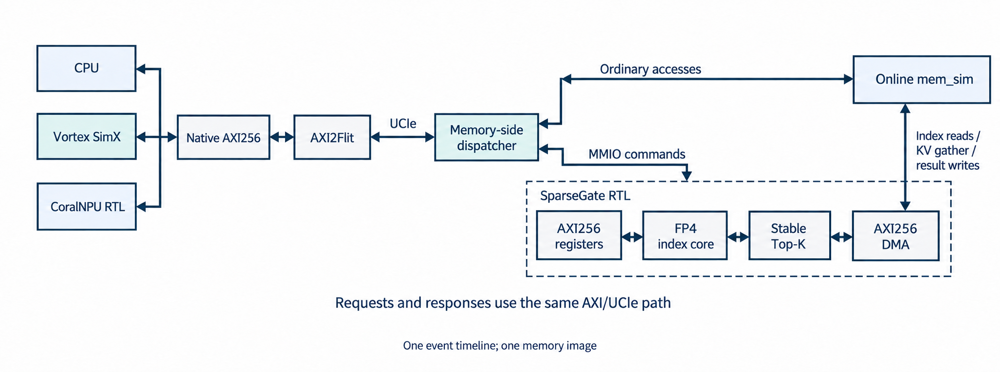

# StorageStacked-SparseGate

面向 **CSA2 稀疏索引**的数字门控电路及统一系统集成。由 `fmq03/StorageStacked` 的 `3be39b697bdc315ae0be08ed2162c322bcf59462` 独立建立，保留原 CPU / Vortex GPU / CoralNPU 系统。



本项目重点是实际门控数据通路和系统接入：FP4 数据进入 RTL，完成多头点积、ReLU、有符号加权归约、Top-K，再从同一个在线存储镜像读取选中的 KV 数据并写回。CPU 提交的命令也经过 AXI2Flit/UCIe。C++ 适配器负责协议和时钟，不替代 RTL 计算分数。

## 算法和电路

选择 2026 年 9 月发布的 [DeepSeek-V4.1-Flash CSA2](https://arxiv.org/abs/2609.19969)，固定官方模型 revision `dba1be0a40aa45a94ad051997016db3960a90277`。支持 **32 个索引头、128 维、Top-512**：

- E2M1 FP4 数值，每 32 维一个 E8M0 scale；有符号 BF16 head weight。
- 16 路小整数乘积，组内精确累加；FP32 RNE 组/头归约，保留 subnormal，溢出报错。
- 一个 K 向量在索引头间共享；流式 min-heap 避免 512 路组合排序链。
- FULL 扫描、REINDEX 候选地址读取、带 context/epoch 检查的 REUSE；位置排序后执行真实 KV gather。
- 原生 AXI256 从接口、独立 DMA 主接口、WSTRB、背压、响应错误、结果提交与版本检查。

**边界：** 投影、归一化、RoPE、压缩、FP4 量化、候选块生成及最终 attention 在核外。三个硬件模式仅覆盖索引/选择的执行阶段。这里是数字近存计算，未绑定 SRAM-CIM 宏；没有完整 552B 模型推理、模型质量或流片结果。FP32 归约次序有明确合同，不能将其称为官方 BF16/CUDA kernel 逐 bit 等价。

## 本次验证结果

核心回归通过 **42 个用例和 130,009 个浮点算术用例**。原系统独立重验通过 19 项 native 测试、7 组 CPU/tester 和 4 组 XPU 用例；新增门控的 5 个原生运行用例完成 22 条命令，其中 4 条是按预期拒绝的过期版本命令。快、慢内存对照使用同一个 guest 可执行文件。验证包含实际 CPU 上传、结果回读、完整 Flit/AXI/RTL 波形及在线存储数据闭合，详见 [系统回执](evidence/system/summary.json)。

完整 **H32/N640/K512** 在线用例的实测结果如下。每条命令均核对 512 个分数/索引记录、零填充和 **147,456 B** 的 gather 输出，FULL 与 REUSE 使用不同的输出地址。

| 模式 | RTL busy 周期 | DMA 读 beat | DMA 写 beat |
|---|---:|---:|---:|
| FULL | 670,572 | 6,624 | 5,120 |
| REUSE | 115,776 | 4,608 | 5,120 |

每个 beat 为 32 B。这里的周期只计 RTL 命令忙区间；完整主机程序还包含上传、轮询与回读。H32/N64/K8 小例把 mem_sim 周期放大 4 倍后，分数、索引和 DMA 数量不变，所有成功命令变慢，完整主机完成时间增加 **181.530 μs**。REUSE 复用已有选择，不能将其与重新算分当作可互换的准确率基线。

16 路算术/选择核心在 TSMC 28-nm HPC+ TT 0.9 V / 25 °C 下完成实际 DC 映射：**301,340.925259 μm²** 标准单元面积、250,241 个叶单元、53,993 个寄存器。2 ns 约束下 setup slack 仅 **+6 fs**，hold slack 为 +5.131 ps；映射、时序覆盖及电气约束检查通过。面积单位已逐单元关联实际 DC 数据库、Liberty 和 LEF。

**该综合使用理想时钟，尚未做 CTS、布局布线、门级等价或物理签核；6 fs 余量不能支持稳健的 500 MHz 芯片结论。** 综合范围也不含 AXI wrapper、DMA 和整个异构系统。原始边界与生产者哈希见 [综合证据](evidence/core/synthesis.json)和[面积核查](evidence/core/area_units.json)。

## 阅读入口

| 内容 | 路径 |
|---|---|
| 电路重构与原论文的区别 | [thesis_redesign.md](docs/sparse_gate/thesis_redesign.md) |
| MMIO、记录格式、DMA、数值与版本合同 | [interface.md](docs/sparse_gate/interface.md) |
| 可综合算术核与 Top-K | [rtl/sparse_gate](rtl/sparse_gate/) |
| AXI256 寄存器与 DMA 电路 | [rtl/sparse_gate_axi](rtl/sparse_gate_axi/) |
| 算法选型、官方来源和独立 oracle | [research](research/) |
| 中文论文 PDF（正文、图表与学术润色） | [SparseGate-paper-zh.pdf](paper/SparseGate-paper-zh.pdf) |
| 英文 IEEE 论文 PDF | [SparseGate-paper.pdf](paper/SparseGate-paper.pdf) |
| 中文 LaTeX、图表与复现入口 | [paper/zh](paper/zh/) |
| LaTeX、测量作图与生成图片提示词 | [paper](paper/) |
| 在线适配、时钟与命令完成规则 | [system_adapter.md](docs/sparse_gate/system_adapter.md) |
| 原统一系统说明 | [upstream_README.md](docs/upstream_README.md) |
| 公开验证证据 | [evidence](evidence/) |

## 复现

统一系统需要 Linux x86-64、构建工具和固定依赖环境，详见 [配置指引](docs/setup.md)。门控模型另外需要 Verilator；核心独立回归还使用 Icarus Verilog。独立的适配层合同测试需要宿主 `g++` 和 `libsystemc-dev`，它与完整系统运行分开，完整系统仍只使用 gem5 原生 SystemC。研究输入依赖见 [research/README.md](research/README.md)，论文使用独立的 [Python/TeX 环境](paper/README.md)。

```sh
git clone --recurse-submodules https://github.com/hy2581/StorageStacked-SparseGate.git
cd StorageStacked-SparseGate
export SS_DEPS_ROOT="$HOME/.local/share/storagestacked-unified"
bash env/bootstrap_xpu.sh
bash env/build_xpu.sh
bash env/build_sparse_gate.sh

# 原路径独立重验：19 项 native、7 组 CPU/tester、4 组 XPU。
bash env/run_memsim.sh results/baseline-memsim
bash env/run_xpu.sh results/baseline-xpu

# 每个输出目录必须不存在。各模式可在构建冻结后并行运行。
bash env/run_sparse_gate.sh results/sparse-gate-system-final-cpu cpu
bash env/run_sparse_gate.sh results/sparse-gate-system-final-three three
bash env/run_sparse_gate.sh results/sparse-gate-system-final-slow cpu-slow
bash env/run_sparse_gate.sh results/sparse-gate-system-final-top512 top512

# 宿主独立 SystemC 合同测试；明确选择与系统库匹配的宿主编译器。
SPARSE_GATE_TEST_CXX=/usr/bin/g++ bash env/test_sparse_gate_backend.sh results/sparse-gate-backend-contract-portable
python3 gem5_axi/scripts/test_sparse_gate_wave.py \
  results/sparse-gate-system-final-cpu/cpu_smoke \
  results/sparse-gate-wave-controls/summary.json
python3 paper/export_completion.py
python3 env/collect_sparse_gate_system.py \
  --gate-top512 results/sparse-gate-system-final-top512
```

独立数字门控 wrapper 回归：`bash rtl/sparse_gate_axi/tests/run.sh`。数值核、并行度实验、研究输入和本机 ASIC 综合的完整入口分别见 [RTL 说明](rtl/sparse_gate/README.md)与[研究说明](research/README.md)。系统大例会生成数 GB 原始链路/波形数据；完整核查在仿真退出后继续执行，不能只看 guest 打印的 PASS。

## 证据边界

[公开系统摘要](evidence/system/summary.json)记录每组执行状态、每条命令的 DMA/score/cycle 数、独立波形忙区间、输入/源码/二进制哈希和内存反馈对照。[核心证据](evidence/core/validation.json)与[并行度实验](evidence/core/lane_sweep.json)单独记录，不与在线系统延迟混用。错误输入按预期拒绝才算对应负向用例通过，文件存在、工具退出或尚未完成不算整体验收。

三个处理源共存用例在原 GPU/NPU 计算完成后运行门控，不声称门控与它们同时争用。预训练权重测试配的是独立随机中间激活，主 KV 为确定性字节图案，用于检验真实搬运；不是完整模型文本推理或质量评测。实际综合范围仅为算术/选择核心，AXI wrapper、DMA 和系统不计入其面积；数字仿真时钟也不是物理签核频率。

工具、模型权重、PDK、构建目录和完整波形不提交到 Git；来源、哈希与重跑入口保留。项目沿用锁定子模块和各目录许可，第三方来源见 [THIRD_PARTY_NOTICES.md](THIRD_PARTY_NOTICES.md)。原仓库撤回记录见 [cleanup.json](evidence/cleanup.json)，旧交付已移到两个活动仓库之外的本地备份。
